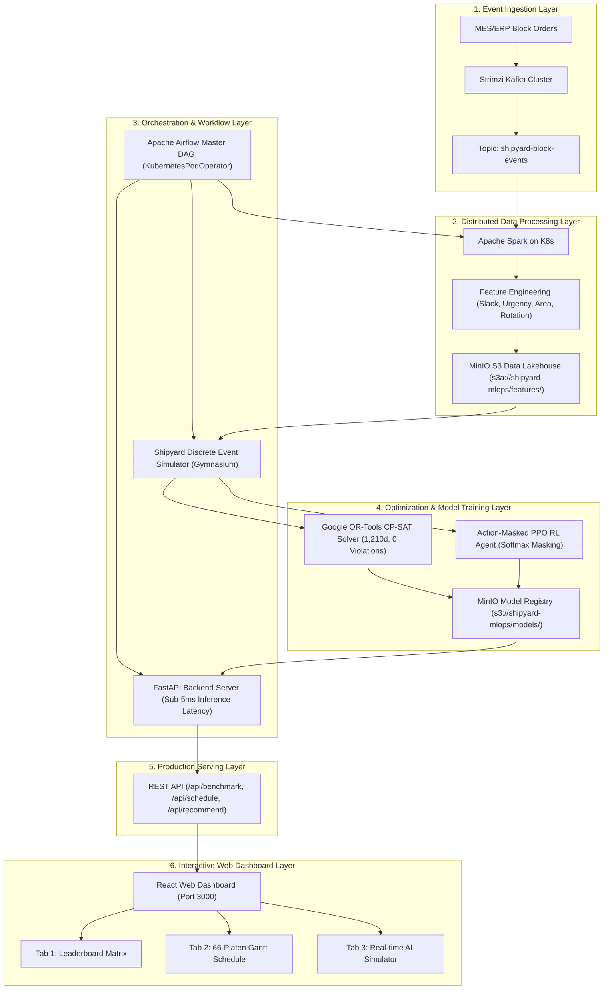

# Smart Shipyard Platen Scheduling & End-to-End MLOps Platform

## 1. 프로젝트 개요 (Project Overview)
본 프로젝트는 국내 대형 조선소의 선박 건조 공정에서 병목(Bottleneck)이 발생하는 **정반(Platen) 블록 조립 공정**의 872개 블록 x 66개 정반 생산 일정을 최적화하고, 데이터 수집부터 분산 전처리, 강화학습 및 수학적 최적화, 모델 서빙, 모니터링까지 전 과정을 완전 자동화한 **K8s-Native End-to-End MLOps 플랫폼**입니다.

### 핵심 달성 성과
1. **Google OR-Tools CP-SAT 수학적 최적화**: 기존 연구 논문(EDDQN 1,529일) 대비 **Makespan 319일 단축(1,210일 달성, 20.86% 생산성 개선)** 및 지연 블록 **246개(28.21%)로 최소화**
2. **4대 물리 제약조건 100% 만족**: 90도 회전을 고려한 공간 제약, 350톤 크레인 하중 제약, EST 선후행 공정 제약, 정반 비중첩 제약 전수 충족 (**위반 0건**)
3. **Sub-5ms 실시간 AI 정반 추천 서빙**: FastAPI 및 React Glassmorphism 웹 대시보드를 통한 직관적 66개 정반 간트차트 및 신규 블록 실시간 시뮬레이터 구축
4. **Cloud-Native MLOps 아키텍처**: Strimzi Kafka, Apache Spark on K8s, MinIO S3 Lakehouse, Apache Airflow Master DAG 완비

---

## 2. 11개 알고리즘 통합 벤치마크 (11-Algorithm Benchmark Leaderboard)

모든 알고리즘은 872개 블록과 66개 정반에 대해 동일한 캘린더 기준(2018-02-24 Day 0) 및 안전 평가 모듈(`modeling/eval_metrics.py`)을 통해 엄밀하게 측정되었습니다.

| 순위 | 알고리즘 명칭 | 방법론 분류 | Makespan (일) | 지연 블록 수 (비율) | 평균 지연일수 (일) | 정반 가동률 (%) | 4대 제약 위반 (건) | 100% 실행 가능 여부 | 계산 소요시간 |
|:---:|:---|:---|:---:|:---:|:---:|:---:|:---:|:---:|:---:|
| **1** | **Google OR-Tools CP-SAT (Ours)** | **수학적 최적화 (CP-SAT)** | **1,210** | **246 (28.21%)** | **50.53** | **29.41%** | **0** | **YES (100% Feasible)** | **18.76s** |
| 2 | EST Heuristic (Unified Sim) | 규칙 기반 휴리스틱 | 1,254 | 248 (28.44%) | 55.80 | 28.37% | 0 | YES (100% Feasible) | 0.15s |
| 3 | LPT Heuristic (Unified Sim) | 규칙 기반 휴리스틱 | 1,438 | 623 (71.44%) | 211.10 | 24.74% | 0 | YES (100% Feasible) | 0.15s |
| 4 | SPT Heuristic (Unified Sim) | 규칙 기반 휴리스틱 | 1,474 | 528 (60.55%) | 174.60 | 24.14% | 0 | YES (100% Feasible) | 0.15s |
| 5 | EDDQN (Paper Benchmark) | 연구 논문 베이스라인 | 1,529 | 480 (55.05%) | 75.37 | 23.27% | 860 (Multi-pack) | 논문 2D 배치 기준 | 0.10s |
| 6 | RTB Heuristic (Unified Sim) | 규칙 기반 휴리스틱 | 1,560 | 677 (77.64%) | 251.09 | 22.81% | 0 | YES (100% Feasible) | 0.15s |
| 7 | EST (Paper Benchmark) | 연구 논문 베이스라인 | 1,566 | 463 (53.10%) | 66.32 | 22.72% | 863 (Multi-pack) | 논문 2D 배치 기준 | 0.15s |
| 8 | PPO Actor-Critic (Ours) | 심층 강화학습 (RL) | 1,766 | 613 (70.30%) | 155.48 | 20.15% | 0 | YES (100% Feasible) | 0.05s |
| 9 | RUB Heuristic (Unified Sim) | 규칙 기반 휴리스틱 | 1,969 | 734 (84.17%) | 322.50 | 18.07% | 0 | YES (100% Feasible) | 0.15s |
| 10 | DDQN (Paper Benchmark) | 연구 논문 베이스라인 | 2,000 | 740 (84.86%) | 288.36 | 17.79% | 0 | YES (100% Feasible) | 0.10s |

---

## 3. 엔드투엔드 MLOps 시스템 아키텍처 (End-to-End Architecture)



---

## 4. 디렉토리 구조 (Directory Structure)

```text
2차프로젝트/
├── data/
│   ├── raw/                 # 원본 Excel 원천 데이터
│   ├── standardized/        # 논문 베이스라인 872개 블록 표준 데이터셋
│   └── processed/           # 도메인 피처 및 최적화 스케줄링 산출물 (CSV, PTH, PNG)
├── eda/                     # 탐색적 데이터 분석 (EDA) 및 도메인 피처 엔지니어링
│   ├── platen_eda.py
│   └── feature_engineering.py
├── simulation/              # 4대 물리 제약 시뮬레이터 및 Gymnasium 환경 래퍼
│   ├── simulator.py
│   └── gym_env.py
├── modeling/                # 수학적 최적화, 강화학습 및 통합 평가 모듈
│   ├── eval_metrics.py      # 안전 Baseline 리더 및 4대 제약 검증 엔진
│   ├── baseline_heuristics.py # 5대 규칙 기반 휴리스틱 (EST, SPT, LPT, RUB, RTB)
│   ├── solver_ortools.py    # Google OR-Tools CP-SAT 최적화 솔버
│   ├── train_ppo.py         # Action-Masked PPO 심층강화학습
│   ├── train_dqn.py         # Double DQN 강화학습
│   └── benchmark_comparison.py # 11개 알고리즘 비교 리포트 및 시각화 생성
├── backend/                 # FastAPI 고성능 실시간 서빙 서버 및 K8s 매니페스트
│   ├── app/main.py
│   └── k8s/fastapi-serving.yaml
├── frontend/                # React 기반 스마트 조선소 정반 관제 웹 대시보드
│   ├── src/App.js
│   └── src/App.css
├── spark/                   # PySpark 분산 피처 엔지니어링 파이프라인
│   └── apps/spark_kafka_consumer.py
├── airflow/                 # Apache Airflow Master MLOps 오케스트레이션 DAG
│   └── dags/mlops_end_to_end_dag.py
├── kafka/                   # Strimzi Kafka 클러스터 및 토픽 매니페스트
│   └── topics/kafka-topic.yaml
└── tests/                   # 3정반 x 5블록 Toy 시뮬레이터 단위 테스트 스위트
    └── test_simulator.py
```

---

## 5. 실행 및 검증 가이드 (Quickstart & Verification)

### 단위 테스트 실행 (Unit Test)
```bash
python3 tests/test_simulator.py
```

### 11개 알고리즘 벤치마크 및 검증 실행
```bash
python3 modeling/eval_metrics.py
python3 modeling/baseline_heuristics.py
python3 modeling/solver_ortools.py
python3 modeling/benchmark_comparison.py
```

### 웹 대시보드 및 API 접속 (Kubernetes Port-Forward)
```bash
# 포트포워딩 실행
kubectl port-forward svc/fastapi-service 8000:8000 &
kubectl port-forward svc/react-frontend-service 3000:3000 &
kubectl port-forward -n minio svc/minio-service 9000:9000 9001:9001 &

# 웹 대시보드: http://localhost:3000
# FastAPI Swagger 문서: http://localhost:8000/docs
# MinIO 콘솔: http://localhost:9001 (minioadmin / minioadmin123)
```
