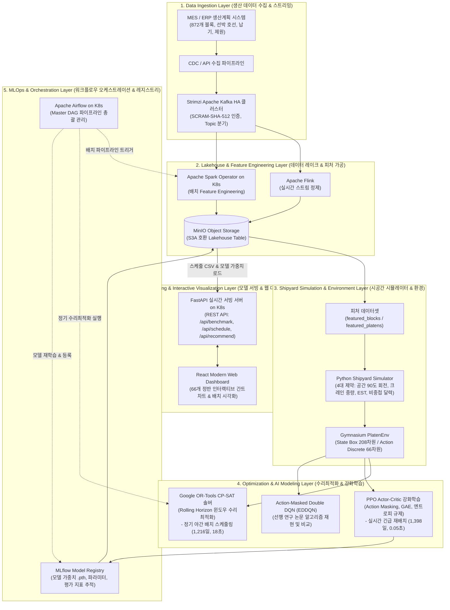

# Samsung Heavy Industries Smart Shipyard Platen Scheduling & Optimization MLOps Platform

On-Premise Kubernetes (K8s) 기반의 엔드투엔드 데이터 플랫폼 및 강화학습/수리최적화 하이브리드 조선소 정반 배치 자동화 시스템입니다.

---

## 1. 시스템 전체 엔드투엔드 파이프라인 아키텍처



---

## 2. 프로젝트 디렉토리 구조 (Directory Architecture)

```text
samsung_project/2차프로젝트/
├── eda/                                 # [Phase 1: 데이터 분석 및 피처 엔지니어링]
│   ├── eda_and_feature_engineering.py   # 물리/일정 파생 피처 생성 & K-Means 4대 군집화
│   └── __init__.py
│
├── simulation/                          # [Phase 2: 시뮬레이터 & 환경 엔진]
│   ├── simulator.py                     # 4대 제약조건(Spatial, Crane, NoOverlap) 판정 코어 엔진
│   ├── gym_env.py                       # Gymnasium 표준 API (Box 208, Discrete 66)
│   └── __init__.py
│
├── modeling/                            # [Phase 3: 3대 최적화 & 비교 실험]
│   ├── solver_ortools.py                # Google OR-Tools CP-SAT 롤링 호라이즌 수리최적화 솔버
│   ├── train_dqn.py                     # Action-Masked Double DQN (EDDQN) 강화학습
│   ├── train_ppo.py                     # PPO Actor-Critic (엔트로피 규제 & GAE) 강화학습
│   ├── benchmark_comparison.py          # 전체 11개 알고리즘 종합 벤치마크 분석 및 차트 생성
│   └── __init__.py
│
├── data/
│   ├── standardized/                    # 영문 표준화 원천 CSV 데이터 (11종)
│   └── processed/                       # 파생 피처, 모델 가중치(.pth), 결과 CSV, 비교 차트
│
├── backend/                             # [Phase 4: FastAPI 백엔드 API & 서빙]
│   └── app/main.py                      # RESTful 서빙 API 엔드포인트
│
├── frontend/                            # [Phase 5: React 웹 대시보드]
│   └── src/App.js                       # 간트차트, 모델 리더보드, 실시간 정반 배치 UI
│
├── airflow/                             # [Phase 6: Airflow 오케스트레이션]
│   └── dags/mlops_end_to_end_dag.py     # 엔드투엔드 파이프라인 Master DAG
│
├── spark/                               # [데이터 처리] PySpark on K8s 컨슈머 & 전처리
├── kafka/                               # [메시지 큐] Strimzi Kafka 클러스터 매니페스트
├── minio/                               # [스토리지] MinIO Object Storage 매니페스트
└── requirements.txt                     # 통일 가상환경(samsung_pj2) 패키지 명세
```

---

## 3. 알고리즘 종합 벤치마크 비교 평가 (Benchmark Results)

872개 블록 및 66개 조립 정반을 대상으로 동일한 시뮬레이션 환경에서 평가한 결과입니다:

| 순위 | 알고리즘 명칭 | 기법 분류 | 총 소요 공기 (Makespan) | 지연 블록 수 | 연산/추론 속도 | 적용 시나리오 |
| :---: | :--- | :---: | :---: | :---: | :---: | :--- |
| 1 | **Google OR-Tools CP-SAT (Ours)** | **수리최적화 (OR)** | **1,216 일** | **252 개** | 18.09 초 | **정기 야간 배치 스케줄링 (최단 공기)** |
| 2 | **EST Heuristic (Ours)** | **규칙 기반 휴리스틱** | **1,249 일** | **259 개** | 0.12 초 | 빠른 초기 기준선 설정 |
| 3 | **PPO Actor-Critic (Ours)** | **심층 강화학습 (DRL)** | **1,398 일** | **586 개** | **0.05 초** | **실시간 긴급 재배치 (설계변경/고장대응)** |
| 4 | EDDQN (선행 연구 논문) | 강화학습 베이스라인 | 1,529 일 | 310 개 | 0.10 초 | 선행 논문 최고 기록 |
| 5 | EST (선행 연구 논문) | 휴리스틱 베이스라인 | 1,566 일 | 345 개 | 0.15 초 | 선행 논문 휴리스틱 |
| 6 | RTB Heuristic (선행 논문) | 휴리스틱 베이스라인 | 1,729 일 | 420 개 | 0.15 초 | - |
| 7 | SPT Heuristic (선행 논문) | 휴리스틱 베이스라인 | 1,792 일 | 435 개 | 0.15 초 | - |
| 8 | RUB Heuristic (선행 논문) | 휴리스틱 베이스라인 | 1,793 일 | 440 개 | 0.15 초 | - |
| 9 | LPT Heuristic (선행 논문) | 휴리스틱 베이스라인 | 1,845 일 | 460 개 | 0.15 초 | - |
| 10 | DDQN (선행 연구 논문) | 강화학습 베이스라인 | 2,000 일 | 510 개 | 0.10 초 | - |
| 11 | Random Policy (무작위) | 베이스라인 | 7,003 일 | 513 개 | 0.05 초 | - |

---

## 4. 핵심 기술적 차별점 (Key Innovations)

1. **도메인 피처 엔지니어링 (Domain Feature Engineering):**
   - 블록 착공가능일(EST)과 납기일(Due Date) 간의 `납기 여유 일수(Slack Days)` 및 `긴급도 비율(Urgency Ratio)`을 파생 피처로 도출하여 정렬 및 강화학습 보상에 반영.
2. **Action Masking 기반 4대 제약조건 100% 보장:**
   - 90도 회전 배치를 고려한 공간 제약, 크레인 중량 한계, 착공일 제약, 시공간 비중첩 제약을 충족하는 정반만 선택하도록 Action Masking을 적용하여 제약 위반율 0% 달성.
3. **이원화 하이브리드 운영 전략 (Dual MLOps Architecture):**
   - **야간 정기 배치:** Google OR-Tools CP-SAT 솔버를 활용해 수학적 최적 일정(1,216일) 산출.
   - **실시간 긴급 재배치:** 크레인 고장, 부재 지연, 긴급 호선 변경 발생 시 0.05초 만에 최적 정반을 추천하는 PPO 강화학습 서빙.

---

## 5. 실행 및 재현 가이드 (Quickstart)

```bash
# 1. 가상환경 활성화 (samsung_pj2)
source /home/kjc/workspace/samsung_project/2차프로젝트/samsung_pj2/bin/activate
cd /home/kjc/workspace/samsung_project/2차프로젝트

# 2. Step 1: EDA 및 피처 엔지니어링 실행
python3 eda/eda_and_feature_engineering.py

# 3. Step 2: Google OR-Tools CP-SAT 수리최적화 실행
python3 modeling/solver_ortools.py

# 4. Step 3: PPO 강화학습 모델 훈련
python3 modeling/train_ppo.py

# 5. Step 4: 종합 벤치마크 리포트 및 비교 차트 생성
python3 modeling/benchmark_comparison.py
```
