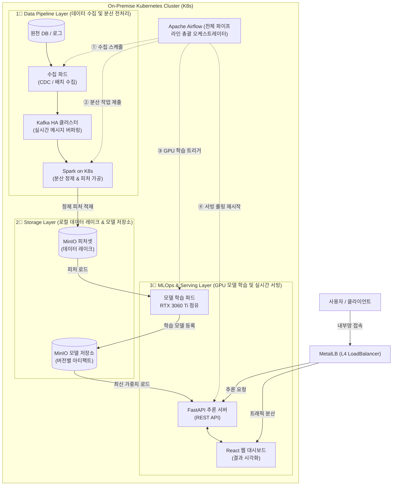

#  100% On-Premise End-to-End MLOps & Data Platform

> **클라우드(AWS/GCP) 비용 $0**, 폐쇄망 환경을 위한 **Kubernetes(K8s) + Kafka + Spark + Airflow + GPU 가속 + MinIO + FastAPI** 엔드투엔드 데이터 엔지니어링 & MLOps 아키텍처입니다.

---

##  시스템 전체 파이프라인 아키텍처 (Kubernetes Cluster)

---

##  컴포넌트별 핵심 기능 (Core Capabilities)

| 영역 | 사용 기술 | 담당 핵심 기능 |
| :--- | :--- | :--- |
| **인프라 & 네트워크** | `Kubernetes (K8s)`, `MetalLB` | 엔터프라이즈 온프레미스 K8s 클러스터 운영 및 내부망 L4 로드밸런싱 |
| **CI/CD** | `GitHub Self-Hosted Runner`, `Local Registry` | 폐쇄망 환경 내 빌드, 도커 이미지 패키징, 무중단 배포 자동화 |
| **데이터 인제스천** | `Airflow Ingestion Pod`, `Kafka HA` | 원천 데이터 배치/실시간 수집 및 안전한 분산 큐잉 |
| **분산 ETL / 피처 가공** | `Apache Spark on K8s` | 대규모 실시간/배치 데이터 분산 정제 및 머신러닝 피처 생성 |
| **파이프라인 오케스트레이션**| `Apache Airflow` | 수집  전처리  GPU 학습  서빙 배포 전 단계 의존성 및 스케줄링 총괄 |
| **스토리지 & 데이터 레이크** | `MinIO (NVMe Local Storage)` | AWS S3 호환 대용량 피처 데이터 및 학습 모델 아티팩트 영속 저장 |
| **머신러닝 GPU 학습** | `PyTorch / XGBoost`, `NVIDIA CUDA` | 온디맨드 로컬 GPU(RTX 3060 Ti) 점유 학습 및 자원 자동 반환 |
| **모델 서빙 & UI** | `FastAPI`, `React` | 0.05초 초고속 실시간 모델 추론 API 및 사용자 웹 인터페이스 제공 |
