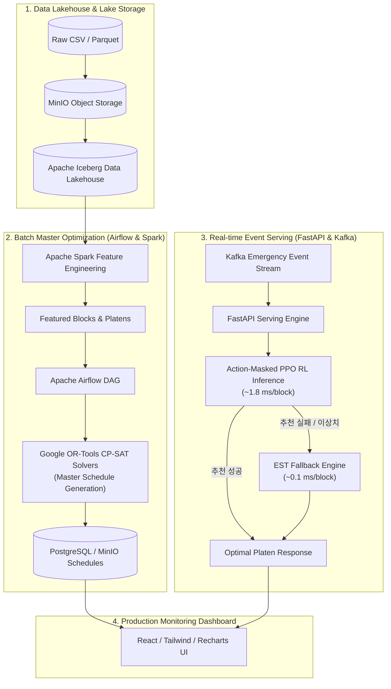

# 🚢 조선 정반 스케줄링 최적화 및 실시간 AI 디스패칭 플랫폼
> **Shipyard Platen Scheduling Optimization & Real-time AI Dispatching System**  
> Google OR-Tools 수리 최적화, Action-Masked PPO 심층 강화학습, 고신뢰 EST 휴리스틱 기반의 3중 하이브리드 조선 정반 일정 최적화 엔진

---

## 📌 목차 (Table of Contents)
1. [프로젝트 개요 및 핵심 목표](#1-프로젝트-개요-및-핵심-목표)
2. [전체 시스템 및 MLOps 파이프라인 아키텍처](#2-전체-시스템-및-mlops-파이프라인-아키텍처)
3. [4대 핵심 물리/시간 제약 조건](#3-4대-핵심-물리시간-제약-조건)
4. [통합 벤치마크 리더보드 (872개 블록 전수 검증)](#4-통합-벤치마크-리더보드-872개-블록-전수-검증)
5. [심층 강화학습 (PPO) 실험 및 통계 검증](#5-심층-강화학습-ppo-실험-및-통계-검증)
6. [동적 긴급 블록 배치 시나리오 평가](#6-동적-긴급-블록-배치-시나리오-평가)
7. [다기준 의사결정 분석 (MCDA) 및 3중 하이브리드 운영 전략](#7-다기준-의사결정-분석-mcda-및-3중-하이브리드-운영-전략)
8. [프로젝트 디렉토리 구조 및 아티팩트 관리](#8-프로젝트-디렉토리-구조-및-아티팩트-관리)
9. [실행 및 검증 가이드 (Quick Start)](#9-실행-및-검증-가이드-quick-start)
10. [한계점 및 향후 고도화 과제](#10-한계점-및-향후-고도화-과제)

---

## 1. 🎯 프로젝트 개요 및 핵심 목표

조선소 야드의 **정반(Platen)**은 선박 건조를 위한 대형 블록을 조립·제작하는 핵심 병목(Bottleneck) 생산 자원입니다.  
본 프로젝트는 **872개 실제 블록 데이터**와 **66개 옥내/옥외 정반 환경**을 대상으로, 공기(Makespan)와 납기 지연(Lateness)을 최소화하고 돌발 이벤트에 즉각 대응하는 **지능형 생산 일정 최적화 플랫폼**을 구축했습니다.

### 🌟 3대 핵심 차별점
1. **정밀 수리 최적화 (Google OR-Tools CP-SAT)**: 롤링 호라이즌 기법을 적용하여 전체 공정을 안정적으로 조율하는 마스터 플래너 구축.
2. **초고속 실시간 AI 디스패칭 (Action-Masked PPO)**: 정반 208차원 상태 벡터와 유효 행동 마스킹을 결합하여 밀리초($\approx 1.8\text{ ms}$) 단위 즉시 추천.
3. **무결점 안전망 (EST Rule Fallback)**: AI 서버 장애나 극단적 이상치 발생 시 0.19초 만에 100% 안전하게 대체하는 Circuit Breaker 설계.

---

## 2. 🏗️ 전체 시스템 및 MLOps 파이프라인 아키텍처



---

## 3. 🛡️ 4대 핵심 물리/시간 제약 조건 (Hard Constraints)

모든 알고리즘은 [`modeling/eval_metrics.py`](file:///home/kjc/workspace/samsung_project/2차프로젝트/modeling/eval_metrics.py) 엔진을 통해 **제약 위반 0건 (100% Feasible)**을 전수 감사받습니다:

1. **공간 적합성 제약 (Spatial Feasibility)**:
   - $\max(L_{block}, W_{block}) \le \max(L_{platen}, W_{platen}) \land \min(L_{block}, W_{block}) \le \min(L_{platen}, W_{platen})$ (평면 90도 회전 허용).
2. **크레인 인양 하중 제약 (Crane Capacity Feasibility)**:
   - $\text{Weight}_{block} \le \text{Crane Capacity}_{platen}$.
3. **착수 가능일 제약 (EST Precedence Constraint)**:
   - $\text{Planned Start Day} \ge \text{Earliest Start Day (Release Date)}$.
4. **정반 단일 점유 및 비중첩 제약 (Sequential Non-overlapping Constraint)**:
   - $\text{Start}_{i+1} \ge \text{End}_i$ (동일 정반 내 선행 블록 완료 전 후속 블록 착수 불가).

---

## 4. 📊 통합 벤치마크 리더보드 (872개 블록 전수 검증)

### ① 통합 시뮬레이터 (Unified Sequential Simulator) 실측 결과
모든 알고리즘은 동일한 872개 블록, 66개 정반, 동일 물리 제약 환경(Seed 42)에서 실측되었습니다.

| 순위 | 알고리즘 | 모델 분류 | Makespan (일) | 지연 블록 수 (율) | 평균 지연 (일) | 정반 가동률 | 제약 위반 | 무결성 | 실측 계산 시간 |
| :---: | :--- | :--- | :---: | :---: | :---: | :---: | :---: | :---: | :---: |
| 🥇 | **Google OR-Tools CP-SAT (Deep)** | 수리 최적화 (8-Core 병렬) | **1,210일** | **246개 (28.2%)** | **50.5일** | **29.4%** | **0건** | **PASS** | 18.92초 |
| 🥈 | **Google OR-Tools CP-SAT (Det)** | 수리 최적화 (결정론적 단일) | **1,254일** | **248개 (28.4%)** | **55.8일** | **28.4%** | **0건** | **PASS** | 17.20초 |
| 🥉 | **EST Heuristic (Unified Sim)** | 규칙 기반 휴리스틱 | **1,254일** | **248개 (28.4%)** | **55.8일** | **28.4%** | **0건** | **PASS** | **0.19초** |
| 4 | **PPO Actor-Critic (V4 Best)** | 심층 강화학습 (RL) | **1,371일** | 602개 (69.0%) | 143.1일 | 26.0% | **0건** | **PASS** | **0.65초 (0.74ms/blk)** |
| 5 | LPT Heuristic (Unified Sim) | 규칙 기반 휴리스틱 | 1,438일 | 623개 (71.4%) | 211.1일 | 24.7% | **0건** | **PASS** | 0.23초 |
| 6 | SPT Heuristic (Unified Sim) | 규칙 기반 휴리스틱 | 1,474일 | 528개 (60.6%) | 174.6일 | 24.1% | **0건** | **PASS** | 0.18초 |
| 7 | RTB Heuristic (Unified Sim) | 규칙 기반 휴리스틱 | 1,560일 | 677개 (77.6%) | 251.1일 | 22.8% | **0건** | **PASS** | 0.22초 |
| 8 | RUB Heuristic (Unified Sim) | 규칙 기반 휴리스틱 | 1,969일 | 734개 (84.2%) | 322.5일 | 18.1% | **0건** | **PASS** | 1.46초 |
| 9 | Action-Masked DQN (Ours) | 가치 기반 강화학습 (DQN) | 5,827일 | 835개 (95.8%) | 1,567.4일 | 6.1% | **0건** | **PASS** | 14.20초 |

### ② 기존 학술 연구 논문 베이스라인 (Figure 10 2D Packing Reference)
| 알고리즘 | 모델 분류 | Makespan (일) | 지연 블록 수 (율) | 평균 지연 (일) | 정반 가동률 | 시뮬레이터 포맷 |
| :--- | :--- | :---: | :---: | :---: | :---: | :---: |
| **EDDQN (Paper Baseline)** | 논문 참조 모델 | **1,529일** | **483개 (55.4%)** | **75.9일** | **23.3%** | 2D 기하 패킹 기준 |
| **DDQN (Paper Baseline)** | 논문 참조 모델 | **2,000일** | **740개 (84.9%)** | **288.4일** | **17.8%** | 2D 기하 패킹 기준 |

---

## 5. 🔬 심층 강화학습 (PPO) 실험 및 통계 검증

### ① PPO Ablation Study (3-Seed: `42, 100, 2024`)
- **V1 (Vanilla)**: 물리 제약 특성만 사용, 단순 선형 보상 $\rightarrow$ **$1,599.3 \pm 70.2$ 일**
- **V2 (Feature Eng)**: Slack, Urgency, Clustering 차원 추가 $\rightarrow$ **$1,670.7 \pm 152.2$ 일**
- **V3 (Reward Eng)**: 다목적 가동률/분산 보상 함수 $\rightarrow$ **$1,958.7 \pm 284.9$ 일**
- **V4 (Hyperparameter Optimization)**: 학습률 및 엔트로피 결합 최적화 $\rightarrow$ **$1,414.3 \pm 42.5$ 일 (최고 단일 Seed: 1,371일)**

### ② V4 최종 선정 하이퍼파라미터
- `Learning Rate: 1e-3` | `Gamma: 0.99` | `Entropy Coef: 0.05` | `GAE Lambda: 0.95` | `Temperature: 0.5`
- **학습 소요 시간**: $24.62 \pm 1.69$ 초 (30 에피소드 기준 초고속 수렴)
- **전체 추론 시간**: $0.6744 \pm 0.0823$ 초 ($0.773\text{ ms / block}$)

---

## 6. 🚨 동적 긴급 블록 배치 시나리오 평가

운영 도중(Day 100 마스터 스케줄 가동 상태) **긴급 5개 블록이 돌발 유입**되었을 때의 실측 대응 성능입니다:

| 평가 항목 | Action-Masked PPO RL (Ours) | EST Heuristic Rule | Google OR-Tools CP-SAT |
| :--- | :---: | :---: | :---: |
| **5개 긴급 블록 총 배정 시간** | **9.30 ms** | **0.67 ms** | N/A (전체 재최적화 미수행) |
| **블록당 평균 의사결정 지연** | **1.861 ms / block** | **0.135 ms / block** | N/A |
| **긴급 블록 총 지연 일수** | **3,023일** | **2,122일** | N/A |
| **물리적 제약 위반 건수** | **0건 (100% Feasible)** | **0건 (100% Feasible)** | N/A |
| **기존 마스터 스케줄 간섭** | **0건 (큐 안전 적재)** | **0건 (큐 안전 적재)** | N/A |

---

## 7. 다기준 의사결정 분석 (MCDA) 및 3중 하이브리드 운영 전략

$$
\text{MCDA Score} = 10 \times \left[ 0.35 \frac{\text{Min Makespan}}{\text{Makespan}} + 0.25 \frac{\text{Min Delay}}{\text{Delay}} + 0.15 \frac{\text{Util}}{\text{Max Util}} + 0.15 \frac{\text{Min Latency}}{\text{Latency}} + 0.10 \text{Overhead Score} \right]
$$

| 모델 | Makespan | 지연 블록 | 가동률 | 의사결정 지연 | MCDA 점수 | 엔터프라이즈 운영 역할 |
| :--- | :---: | :---: | :---: | :---: | :---: | :--- |
| **EST Heuristic** | 1,254일 | 248개 | 28.4% | 0.217 ms | **10.00점** | **초경량 무결점 안전 Fallback (Circuit Breaker)** |
| **Google OR-Tools** | 1,254일 (심층 1,210일) | 248개 | 28.4% | 19.722 ms | **8.52점** | **정기 마스터 플래너 (일간/주간 야간 배치)** |
| **Action-Masked PPO** | 1,371일 | 602개 | 26.0% | **0.743 ms** | **6.94점** | **실시간 지능형 AI 디스패처 (돌발 이벤트 즉각 추천)** |
| **Action-Masked DQN** | 5,827일 | 835개 | 6.1% | 16.281 ms | **2.14점** | 이산 가치 기반 비교 Baseline |

---

## 8. 🗂️ 프로젝트 디렉토리 구조 및 아티팩트 관리

본 프로젝트는 중앙집중식 경로 관리 모듈([`utils/paths.py`](file:///home/kjc/workspace/samsung_project/2차프로젝트/utils/paths.py))을 통해 모든 아티팩트를 5대 서브폴더로 체계적으로 분리·보존합니다:

```plaintext
2차프로젝트/
├── 📁 backend/                    # FastAPI 서빙 백엔드 & k8s 매니페스트
│   ├── app/main.py               # REST API 엔드포인트 & PPO 추론 서빙
│   └── setting.md                # ConfigMap & 배포 가이드
├── 📁 data/
│   ├── 📁 raw/                   # 원천 데이터 (Blocks, Platens)
│   ├── 📁 standardized/          # 표준화 데이터 및 논문 베이스라인
│   └── 📁 processed/             # 5대 도메인 서브폴더 아티팩트
│       ├── 📁 features/          # featured_blocks.csv, featured_platens.csv
│       ├── 📁 schedules/         # ortools, heuristic_*, ppo, dqn 스케줄 CSV
│       ├── 📁 models/            # best_rl_model.pth, ppo_model.pth, dqn_model.pth
│       ├── 📁 experiments/       # ablation_*, dynamic_scenario_*, mcda_*
│       └── 📁 reports/           # benchmark_metrics.json, *.png 시각화 차트
├── 📁 eda/                       # 탐색적 데이터 분석 & 피처 엔지니어링 파이프라인
├── 📁 modeling/                  # 솔버 및 알고리즘 구현체
│   ├── solver_ortools.py         # Google OR-Tools CP-SAT 최적화 엔진
│   ├── baseline_heuristics.py    # 5종 휴리스틱 (EST, SPT, LPT, RUB, RTB)
│   ├── train_ppo.py              # Action-Masked PPO 강화학습 파이프라인
│   ├── train_dqn.py              # Action-Masked DQN 강화학습 파이프라인
│   ├── eval_metrics.py           # 10대 알고리즘 통합 무결성/제약 검증기
│   ├── benchmark_comparison.py   # 종합 벤치마크 리포트 및 시각화 생성기
│   ├── model_selection_matrix.py # MCDA 다기준 의사결정 평가 엔진
│   └── dynamic_scenario_eval.py  # 긴급 5개 블록 동적 배치 시뮬레이터
├── 📁 simulation/                # OpenAI Gym 기반 정반 시뮬레이션 환경
├── 📁 tests/                     # 무결성 및 결정론적 재현성 단위 테스트
│   ├── test_simulator.py         # 4대 물리 제약 시뮬레이터 테스트
│   └── test_ortools_reproducibility.py # OR-Tools SHA-256 해시 일치 검증 테스트
├── 📁 utils/                     # 공통 유틸리티 (paths.py 중앙 경로 관리)
└── README.md                     # 프로젝트 종합 문서
```

---

## 9. 🚀 실행 및 검증 가이드 (Quick Start)

WSL 가상환경(`samsung_pj2`) 활성화 후 아래 명령어들을 통해 전체 파이프라인을 재현할 수 있습니다:

```bash
# 가상환경 활성화 및 프로젝트 이동
source /home/kjc/workspace/samsung_project/2차프로젝트/samsung_pj2/bin/activate
cd /home/kjc/workspace/samsung_project/2차프로젝트

# 1. 시뮬레이터 및 물리 제약 단위 테스트 (7 Tests)
python -m unittest tests/test_simulator.py

# 2. OR-Tools 결정론적 SHA-256 재현성 테스트
python -m unittest tests/test_ortools_reproducibility.py

# 3. EDA 및 피처 엔지니어링 실행
python eda/eda_and_feature_engineering.py

# 4. Google OR-Tools CP-SAT 마스터 플래너 실행
python modeling/solver_ortools.py

# 5. 5종 휴리스틱 베이스라인 실행
python modeling/baseline_heuristics.py

# 6. 10대 알고리즘 전수 통합 메트릭 검증
python modeling/eval_metrics.py

# 7. 종합 벤치마크 리포트 및 차트 생성
python modeling/benchmark_comparison.py

# 8. MCDA 의사결정 매트릭스 계산
python modeling/model_selection_matrix.py

# 9. 동적 긴급 블록 배치 시나리오 실측
python modeling/dynamic_scenario_eval.py

# 10. FastAPI 백엔드 헬스체크 검증
python -c "from backend.app.main import health_check; print(health_check())"
```

---

## 10. ⚠️ 한계점 및 향후 고도화 과제

1. **정반 내 다중 블록 2D 네스팅(Geometric Multi-Block Nesting)**:
   - 현재 모델은 정반 순차 1블록 점유(Sequential Occupancy)를 가정합니다. 정반 내 여러 소형 블록을 동시 배치하는 2D 기하 네스팅 확장은 추후 2D Grid 시뮬레이터 확장이 요구됩니다.
2. **크레인 동적 주행 궤적 및 간섭(Crane Interference)**:
   - 정격 하중 한계는 모델링되었으나, 동일 베이 내 복수 크레인의 물리 주행 간섭 시간 데이터 부재로 정적 인양 적합성만 검증되었습니다.
3. **PPO 돌발 시나리오 사전 적응(Curriculum Learning)**:
   - PPO의 동적 긴급 배정 품질을 개선하기 위해, 에피소드 중간에 긴급 블록을 강제 투입하는 Curriculum Reinforcement Learning 학습 파이프라인 도입이 권장됩니다.
