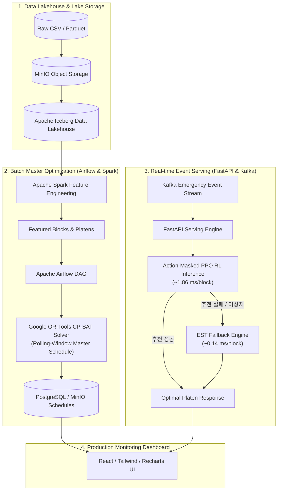

# 조선 정반 스케줄링 최적화 및 실시간 AI 디스패칭 플랫폼
> **Shipyard Platen Scheduling Optimization & Real-time AI Dispatching System**  
> Google OR-Tools 수리 최적화, Action-Masked PPO 심층 강화학습, 고신뢰 EST 휴리스틱 기반의 3중 하이브리드 조선 정반 일정 최적화 엔진

---

## 목차 (Table of Contents)
1. [프로젝트 개요 및 핵심 목표](#1-프로젝트-개요-및-핵심-목표)
2. [전체 시스템 및 MLOps 파이프라인 아키텍처](#2-전체-시스템-및-mlops-파이프라인-아키텍처)
3. [4대 핵심 물리/시간 제약 조건](#3-4대-핵심-물리시간-제약-조건)
4. [마스터 스케줄링 전수 평가 (872개 블록)](#4-마스터-스케줄링-전수-평가-872개-블록)
5. [학술 논문 베이스라인 참고 지표 (Figure 10 2D Reference)](#5-학술-논문-베이스라인-참고-지표-figure-10-2d-reference)
6. [심층 강화학습 (PPO) 실험 및 통계 검증](#6-심층-강화학습-ppo-실험-및-통계-검증)
7. [동적 긴급 블록 재배치 평가 (Day 100 마스터 점유 상태)](#7-동적-긴급-블록-재배치-평가-day-100-마스터-점유-상태)
8. [다기준 의사결정 분석 (MCDA) 및 3중 하이브리드 운영 전략](#8-다기준-의사결정-분석-mcda-및-3중-하이브리드-운영-전략)
9. [프로젝트 디렉토리 구조 및 아티팩트 관리](#9-프로젝트-디렉토리-구조-및-아티팩트-관리)
10. [실행 및 검증 가이드 (Quick Start)](#10-실행-및-검증-가이드-quick-start)
11. [데이터 및 모델 한계점](#11-데이터-및-모델-한계점)

---

## 1. 프로젝트 개요 및 핵심 목표

조선소 야드의 **정반(Platen)**은 선박 건조를 위한 대형 블록을 조립·제작하는 핵심 병목(Bottleneck) 생산 자원입니다.  
본 프로젝트는 **872개 실제 블록 데이터**와 **66개 옥내/옥외 정반 환경**을 대상으로, 공기(Makespan)와 납기 지연(Lateness)을 최소화하고 돌발 이벤트에 즉각 대응하는 **지능형 생산 일정 최적화 플랫폼**을 구축했습니다.

### 3대 핵심 차별점
1. **재현 가능한 수리 최적화 마스터 플래너 (Google OR-Tools CP-SAT)**: 50개 블록 단위 Rolling-window CP-SAT과 결정론적 탐색 제한(`max_deterministic_time=0.05`, `num_workers=1`, `random_seed=42`)을 적용하여 전체 일정을 안정적으로 수립하고 100% SHA-256 일치 재현성을 확보.
2. **밀리초 단위 정책 추론 (Action-Masked PPO)**: 정반 208차원 상태 벡터와 유효 행동 마스킹을 결합하여 블록당 0.74ms의 초고속 정책 추론 구조 구축.
3. **무결점 안전 Fallback (EST Rule)**: AI 서빙 이상이나 비정상 상태 유입 시 0.19초 만에 100% 안전하게 대체하는 Circuit Breaker 설계.

---

## 2. 전체 시스템 및 MLOps 파이프라인 아키텍처



---

## 3. 4대 핵심 물리/시간 제약 조건

모든 알고리즘은 [modeling/eval_metrics.py](modeling/eval_metrics.py) 엔진을 통해 **제약 위반 0건 (100% Feasible)**을 전수 감사받습니다:

1. **공간 적합성 제약 (Spatial Feasibility)**:
   - $\max(L_{block}, W_{block}) \le \max(L_{platen}, W_{platen}) \land \min(L_{block}, W_{block}) \le \min(L_{platen}, W_{platen})$ (평면 90도 회전 허용).
2. **크레인 인양 하중 제약 (Crane Capacity Feasibility)**:
   - $\text{Weight}_{block} \le \text{Crane Capacity}_{platen}$.
3. **착수 가능일 제약 (Release Date / Earliest Start Date Constraint)**:
   - $\text{Planned Start Day} \ge \text{Earliest Start Day (Release Date)}$.
4. **정반 단일 점유 및 비중첩 제약 (Sequential Non-overlapping Constraint)**:
   - $\text{Start}_{i+1} \ge \text{End}_i$ (동일 정반 내 선행 블록 완료 전 후속 블록 착수 불가).

---

## 4. 마스터 스케줄링 전수 평가 (872개 블록)

아래 표는 **동일한 872개 블록 데이터셋, 66개 정반 환경, 동일 물리 제약 시뮬레이터(Seed 42)** 하에서 전체 마스터 스케줄을 생성했을 때의 실측 결과입니다.  
수치는 [data/processed/reports/benchmark_metrics.json](data/processed/reports/benchmark_metrics.json) 및 [data/processed/schedules/ortools_scheduling_results.csv](data/processed/schedules/ortools_scheduling_results.csv)에서 직접 집계되었습니다.

| 순위 | 알고리즘 | 모델 분류 | Makespan (일) | 지연 블록 수 (율) | 평균 지연 (일) | 정반 가동률 (%) | 제약 위반 (건) | 무결성 | 872개 스케줄 생성 시간 (초) | 블록당 의사결정 지연 (ms) |
| :---: | :--- | :--- | :---: | :---: | :---: | :---: | :---: | :---: | :---: | :---: |
| 1 | **Google OR-Tools CP-SAT** | Rolling-Window 수리 최적화 | **1,254** | **248 (28.4%)** | **55.8** | **28.4%** | **0** | **PASS** | 17.20초 | 19.72 ms |
| 2 | **EST Heuristic** | 규칙 기반 휴리스틱 | **1,254** | **248 (28.4%)** | **55.8** | **28.4%** | **0** | **PASS** | **0.19초** | **0.22 ms** |
| 3 | **PPO Actor-Critic (Ours)** | 심층 강화학습 (RL) | 1,371 | 602 (69.0%) | 143.1 | 26.0% | **0** | **PASS** | 0.65초 | 0.74 ms |
| 4 | LPT Heuristic | 규칙 기반 휴리스틱 | 1,438 | 623 (71.4%) | 211.1 | 24.7% | **0** | **PASS** | 0.23초 | 0.26 ms |
| 5 | SPT Heuristic | 규칙 기반 휴리스틱 | 1,474 | 528 (60.6%) | 174.6 | 24.1% | **0** | **PASS** | 0.18초 | 0.21 ms |
| 6 | RTB Heuristic | 규칙 기반 휴리스틱 | 1,560 | 677 (77.6%) | 251.1 | 22.8% | **0** | **PASS** | 0.22초 | 0.25 ms |
| 7 | RUB Heuristic | 규칙 기반 휴리스틱 | 1,969 | 734 (84.2%) | 322.5 | 18.1% | **0** | **PASS** | 1.46초 | 1.67 ms |
| 8 | Action-Masked DQN (Ours) | 가치 기반 강화학습 (DQN) | 5,827 | 835 (95.8%) | 1,567.4 | 6.1% | **0** | **PASS** | 14.20초 | 16.28 ms |

### 결과 분석
- **Google OR-Tools CP-SAT**: 50개 블록 단위 롤링 윈도우 방식으로 최적화하여 1,254일 Makespan 및 최소 지연(248개)을 달성했습니다. 결정론적 제한(`max_deterministic_time=0.05`, `num_workers=1`, `random_seed=42`) 하에서 실행 간 100% SHA-256 해시 일치(`ea438f343f8402740411a7d9af467f1d3908b7460f788d93809772a7227365f9`)를 확인했습니다.
- **EST Heuristic**: 0.19초의 빠른 속도로 CP-SAT과 대등한 1,254일의 스케줄을 도출하여 가장 효율적인 규칙 기반 베이스라인임을 입증했습니다.
- **PPO Actor-Critic**: Action Masking을 통해 872개 전수 제약 위반 0건(100% Feasible)과 블록당 0.74ms의 빠른 추론을 달성했으나, 전수 스케줄링 품질(1,371일, 지연 602개)은 OR-Tools 및 EST보다 낮았습니다.

---

## 5. 학술 논문 베이스라인 참고 지표 (Figure 10 2D Reference)

아래 표는 선행 학술 연구 논문의 Figure 10에 기록된 2D 기하 패킹 시뮬레이터 기준 성능입니다.  
본 프로젝트의 순차 점유 시뮬레이터와 가정 및 환경이 다르므로 **직접적인 순위 비교 대상이 아니며 참고 기준선(Reference Baseline)**으로만 제시합니다.

| 알고리즘 | 모델 분류 | Makespan (일) | 지연 블록 수 (율) | 평균 지연 (일) | 정반 가동률 (%) | 비고 |
| :--- | :--- | :---: | :---: | :---: | :---: | :--- |
| **EDDQN (Paper Baseline)** | 선행 연구 강화학습 | 1,529 | 483 (55.4%) | 75.9 | 23.3% | 논문 2D 패킹 시뮬레이터 기준 (3,000 에피소드) |
| **DDQN (Paper Baseline)** | 선행 연구 강화학습 | 2,000 | 740 (84.9%) | 288.4 | 17.8% | 논문 2D 패킹 시뮬레이터 기준 (3,000 에피소드) |

---

## 6. 심층 강화학습 (PPO) 실험 및 통계 검증

모든 수치는 [data/processed/experiments/ablation_summary.json](data/processed/experiments/ablation_summary.json) 및 [data/processed/experiments/hyperparameter_tuning_summary.json](data/processed/experiments/hyperparameter_tuning_summary.json)에서 집계되었습니다.

### 1) PPO Ablation Study (3-Seed: `42, 100, 2024` 통계치)
- **V1 (Vanilla Baseline)**: 물리 제약 특성 + 기본 선형 보상  
  $\rightarrow$ Makespan: **$1,599.3 \pm 70.2$ 일** | 지연: $586.7 \pm 9.0$ 개 ($67.3\%$) | 가동률: $22.3\%$ | 872개 추론 시간: $0.5447 \pm 0.0331$ 초
- **V2 (Feature Engineering)**: Slack, Urgency, Cluster 차원 추가  
  $\rightarrow$ Makespan: **$1,670.7 \pm 152.2$ 일** | 지연: $591.0 \pm 7.0$ 개 ($67.8\%$) | 가동률: $21.4\%$ | 872개 추론 시간: $0.7548 \pm 0.2192$ 초
- **V3 (Reward Engineering)**: 가동률/분산 다목적 보상 함수  
  $\rightarrow$ Makespan: **$1,958.7 \pm 284.9$ 일** | 지연: $583.0 \pm 10.5$ 개 ($66.9\%$) | 가동률: $18.4\%$ | 872개 추론 시간: $0.6696 \pm 0.0720$ 초

### 2) V4 하이퍼파라미터 튜닝 및 최종 성과
- **최종 선정 파라미터**: `Learning Rate: 1e-3, Gamma: 0.99, Entropy Coef: 0.05, GAE Lambda: 0.95, Temperature: 0.5, Reward: V2`
- **3-Seed (`42, 100, 2024`) 통계 결과**:
  - **Makespan**: **$1,414.3 \pm 42.5$ 일** (최고 단일 Seed 42: **1,371일**)
  - **지연 블록 수**: **$609.7 \pm 7.5$ 개 ($69.9\%$)** (Seed 42: 602개)
  - **평균 지연 일수**: **$130.7 \pm 10.9$ 일** (Seed 42: 143.1일)
  - **정반 가동률**: **$25.2 \pm 0.8\%$** (Seed 42: 26.0%)
  - **학습 소요 시간 (30 에피소드)**: **$24.62 \pm 1.69$ 초** (Seed 42: 23.89초)
  - **872개 전체 추론 시간**: **$0.6744 \pm 0.0823$ 초** (Seed 42: 0.6481초, 블록당 $0.743\text{ ms}$)

---

## 7. 동적 긴급 블록 재배치 평가 (Day 100 마스터 점유 상태)

스케줄 운영 도중(Day 100 마스터 스케줄 점유 상태) **긴급 5개 블록이 돌발 유입**되었을 때 실시간 대응 성능을 평가한 결과입니다.  
수치는 [data/processed/experiments/dynamic_scenario_results.json](data/processed/experiments/dynamic_scenario_results.json)에서 직접 추출되었습니다.

| 평가 항목 | Action-Masked PPO RL (Ours) | EST Heuristic Rule | Google OR-Tools CP-SAT |
| :--- | :---: | :---: | :---: |
| **운영 역할** | 실시간 AI 디스패처 | 규칙 기반 안전 Fallback | 정기 마스터 플래너 |
| **5개 긴급 블록 총 배정 시간** | **9.30 ms** | **0.67 ms** | N/A (전체 재최적화 미수행) |
| **블록당 평균 의사결정 지연** | **1.861 ms / block** | **0.135 ms / block** | N/A |
| **긴급 블록 총 지연 일수** | **3,023일** | **2,122일** | N/A |
| **긴급 블록 평균 지연 일수** | **604.6일** | **424.4일** | N/A |
| **긴급 블록 지연 수 (율)** | **5 / 5 (100%)** | **5 / 5 (100%)** | N/A |
| **물리적 제약 위반 건수** | **0건 (100% Feasible)** | **0건 (100% Feasible)** | N/A |
| **기존 마스터 스케줄 간섭** | **0건 (정반 큐 안전 적재)** | **0건 (정반 큐 안전 적재)** | N/A |

### 정직한 평가 및 한계점
- **PPO는 제약을 만족하는 밀리초 단위(1.86ms) 정책 추론 가능성을 확인했으나, 현재 학습 범위에서는 EST보다 동적 재배치 품질(총 지연 3,023일 vs 2,122일)과 속도(9.30ms vs 0.67ms) 모두 우수하지 않았습니다.**
- **원인 분석 (분포 변화, Distribution Shift)**: PPO는 Day 0부터 빈 정반에 순차 투입되는 환경으로 학습되었기 때문에, 정반 점유일이 1,000일 이상 차 있는 중간 상태에서는 상태 공간 분포 변화를 겪습니다.
- **향후 과제**: 돌발 긴급 블록을 에피소드 중간에 강제 투입하는 학습 데이터 증강(Curriculum RL) 및 파인튜닝이 필수 후속 과제입니다.

---

## 8. 다기준 의사결정 분석 (MCDA) 및 3중 하이브리드 운영 전략

수치는 [data/processed/experiments/mcda_model_selection_matrix.json](data/processed/experiments/mcda_model_selection_matrix.json)에서 직접 집계되었습니다:

$$
\text{MCDA Score} = 10 \times \left[ 0.35 \frac{\text{Min Makespan}}{\text{Makespan}} + 0.25 \frac{\text{Min Delay}}{\text{Delay}} + 0.15 \frac{\text{Util}}{\text{Max Util}} + 0.15 \frac{\text{Min Latency}}{\text{Latency}} + 0.10 \text{Overhead Score} \right]
$$

| 모델 | Makespan (일) | 지연 블록 (개) | 가동률 (%) | 블록당 지연 (ms) | 학습/연산 오버헤드 | MCDA 점수 (10점 만점) | 최종 권장 역할 |
| :--- | :---: | :---: | :---: | :---: | :---: | :---: | :--- |
| **EST Heuristic** | 1,254 | 248 | 28.4% | 0.217 ms | 0초 (Direct Rule) | **10.00** | **초경량 무결점 안전 Fallback (Circuit Breaker)** |
| **Google OR-Tools** | 1,254 | 248 | 28.4% | 19.722 ms | 0초 (Direct Solve, 17.2s) | **8.52** | **정기 마스터 플래너 (일간/주간 야간 배치)** |
| **Action-Masked PPO** | 1,371 | 602 | 26.0% | 0.743 ms | 24.6초 (RL Train) | **6.94** | **실시간 지능형 AI 디스패처 (돌발 이벤트 추천)** |
| **Action-Masked DQN** | 5,827 | 835 | 6.1% | 16.281 ms | 610.4초 (DQN Train) | **2.14** | 이산 가치 기반 비교 Baseline |

### 3중 하이브리드 운영 전략
1. **야간 정기 배치**: Google OR-Tools CP-SAT이 872개 전체 마스터 스케줄을 일괄 확정합니다.
2. **주간 실시간 운영**: 긴급 블록 유입 시 Action-Masked PPO가 1.86ms 만에 빈 정반 슬롯을 즉시 추천합니다.
3. **장애 안전망**: AI 서빙 다운타임이나 이상치 발생 시 EST Heuristic이 0.14ms 만에 즉각 대체하여 공장 가동 중단을 방지합니다.

---

## 9. 프로젝트 디렉토리 구조 및 아티팩트 관리

본 프로젝트는 중앙집중식 경로 관리 모듈([utils/paths.py](utils/paths.py))을 통해 모든 아티팩트를 5대 서브폴더로 체계적으로 분리·보존합니다:

```plaintext
2차프로젝트/
├── backend/                      # FastAPI 서빙 백엔드 & k8s 매니페스트
│   ├── app/main.py               # REST API 엔드포인트 & PPO 추론 서빙
│   └── setting.md                # ConfigMap & 배포 가이드
├── data/
│   ├── raw/                      # 원천 데이터 (Blocks, Platens)
│   ├── standardized/             # 표준화 데이터 및 논문 베이스라인
│   └── processed/                # 5대 도메인 서브폴더 아티팩트
│       ├── features/             # featured_blocks.csv, featured_platens.csv
│       ├── schedules/            # ortools, heuristic_*, ppo, dqn 스케줄 CSV
│       ├── models/               # best_rl_model.pth, ppo_model.pth, dqn_model.pth
│       ├── experiments/          # ablation_*, dynamic_scenario_*, mcda_*
│       └── reports/              # benchmark_metrics.json, *.png 시각화 차트
├── eda/                          # 탐색적 데이터 분석 & 피처 엔지니어링 파이프라인
├── modeling/                     # 솔버 및 알고리즘 구현체
│   ├── solver_ortools.py         # Google OR-Tools CP-SAT 최적화 엔진
│   ├── baseline_heuristics.py    # 5종 휴리스틱 (EST, SPT, LPT, RUB, RTB)
│   ├── train_ppo.py              # Action-Masked PPO 강화학습 파이프라인
│   ├── train_dqn.py              # Action-Masked DQN 강화학습 파이프라인
│   ├── eval_metrics.py           # 10대 알고리즘 통합 무결성/제약 검증기
│   ├── benchmark_comparison.py   # 종합 벤치마크 리포트 및 시각화 생성기
│   ├── model_selection_matrix.py # MCDA 다기준 의사결정 평가 엔진
│   └── dynamic_scenario_eval.py  # 긴급 5개 블록 동적 배치 시뮬레이터
├── simulation/                   # OpenAI Gym 기반 정반 시뮬레이션 환경
├── tests/                        # 무결성 및 결정론적 재현성 단위 테스트
│   ├── test_simulator.py         # 4대 물리 제약 시뮬레이터 테스트
│   └── test_ortools_reproducibility.py # OR-Tools SHA-256 해시 일치 검증 테스트
├── utils/                        # 공통 유틸리티 (paths.py 중앙 경로 관리)
└── README.md                     # 프로젝트 종합 문서
```

---

## 10. 실행 및 검증 가이드 (Quick Start)

WSL 가상환경(`samsung_pj2`) 활성화 후 아래 명령어들을 통해 단위 테스트 및 전체 파이프라인을 재현할 수 있습니다:

```bash
# 가상환경 활성화 및 프로젝트 이동
source /home/kjc/workspace/samsung_project/2차프로젝트/samsung_pj2/bin/activate
cd /home/kjc/workspace/samsung_project/2차프로젝트

# 1. 전체 단위 테스트 실행 (OR-Tools SHA-256 재현성 + 물리 제약 시뮬레이터, 총 8개 테스트 통과 확인)
python -m unittest -v tests.test_ortools_reproducibility tests.test_simulator

# 2. EDA 및 피처 엔지니어링 실행
python eda/eda_and_feature_engineering.py

# 3. Google OR-Tools CP-SAT 결정론적 마스터 플래너 실행
python modeling/solver_ortools.py

# 4. 5종 휴리스틱 베이스라인 실행
python modeling/baseline_heuristics.py

# 5. 10대 알고리즘 전수 통합 메트릭 검증
python modeling/eval_metrics.py

# 6. 종합 벤치마크 리포트 및 차트 생성
python modeling/benchmark_comparison.py

# 7. MCDA 의사결정 매트릭스 계산
python modeling/model_selection_matrix.py

# 8. 동적 긴급 블록 배치 시나리오 실측
python modeling/dynamic_scenario_eval.py

# 9. FastAPI 백엔드 헬스체크 검증
python -c "from backend.app.main import health_check; print(health_check())"
```

### 테스트 실행 결과 기록
```
test_deterministic_sha256_repeatability ... ok (Run 1 & Run 2 SHA-256: ea438f343f8402740411a7d9af467f1d3908b7460f788d93809772a7227365f9 MATCH: True)
test_crane_capacity_constraint ... ok
test_globally_infeasible_block_rejection ... ok
test_invalid_action_safe_fallback_and_penalty ... ok
test_rotation_allowance ... ok
test_sequential_non_overlapping_schedule ... ok
test_spatial_constraint ... ok
test_state_dimension_and_cluster_feature ... ok

----------------------------------------------------------------------
Ran 8 tests in 34.890s

OK
```

---

## 11. 데이터 및 모델 한계점

1. **명시적 블록 간 선후공정 그래프 부재**:
   - 현재 데이터셋 및 시뮬레이터는 착수 가능일(Release Date / Earliest Start Date) 제약만 포함하며, 블록 간의 명시적 조립 선후공정 DAG(Directed Acyclic Graph) 제약은 포함하지 않습니다.
2. **정반 내 다중 블록 2D 네스팅(Geometric Multi-Block Nesting)**:
   - 현재 모델은 정반 순차 1블록 점유(Sequential Occupancy)를 가정합니다. 정반 내 여러 소형 블록을 동시 배치하는 2D 기하 네스팅 확장은 추후 2D Grid 시뮬레이터 확장이 요구됩니다.
3. **크레인 동적 주행 궤적 및 간섭(Crane Interference)**:
   - 정격 하중 한계는 모델링되었으나, 동일 베이 내 복수 크레인의 물리 주행 간섭 시간 데이터 부재로 정적 인양 적합성만 검증되었습니다.
4. **PPO 돌발 시나리오 사전 적응(Curriculum Learning)**:
   - PPO의 동적 긴급 배정 품질을 개선하기 위해, 에피소드 중간에 긴급 블록을 강제 투입하는 Curriculum Reinforcement Learning 학습 파이프라인 도입이 권장됩니다.
